# System Architecture & AI Pipeline Specification

## Project Title
**SMART FORENSIC FACE SKETCH GENERATION AND REAL-TIME BIOMETRIC IDENTIFICATION USING AI AND COMPUTER VISION**  
*Academic B.Tech AIML Final Year Project*

---

## 1. High-Level Architectural Diagram

```mermaid
flowchart TD
    subgraph Frontend["React Modern Forensic UI (Port 5173)"]
        UI_Dash["1. Command Center Dashboard"]
        UI_Sketch["2. AI Face Sketch Generator"]
        UI_NLP["3. Text Description Parser"]
        UI_Voice["4. Voice-Guided Sketch (Web Speech)"]
        UI_Recog["5. ArcFace Recognition Probe"]
        UI_CCTV["6. Real-Time Surveillance CCTV"]
        UI_DB["7. Suspect Gallery Database"]
        UI_Hist["8. Biometric Recognition History"]
        UI_Rep["9. Forensic Examination Reports"]
        UI_Set["10. System Configuration"]
        UI_3D["3D Craniofacial Wireframe Viewer"]
    end

    subgraph Transport["Communication Layer"]
        REST["REST APIs (HTTP/JSON)"]
        WS["WebSockets (/api/cctv/ws)"]
    end

    subgraph Backend["FastAPI Python Microservices (Port 8000)"]
        API_Auth["Authentication & RBAC"]
        API_Sketch["Sketch & Latent API"]
        API_NLP["NLP Semantic Parser API"]
        API_Voice["Speech STT API"]
        API_Recog["ArcFace Cosine Metric API"]
        API_CCTV["Surveillance Engine"]
        API_DB["Suspect Gallery CRUD"]
        API_Rep["Report Generation Engine"]
    end

    subgraph AI_Engine["Modular AI / Computer Vision Architecture (ai_models/)"]
        GAN_Mod["GAN Face Sketch Synthesizer\n(Parametric Latent Generator)"]
        ArcFace_Mod["ArcFace / FaceNet Embedder\n(512-D Normalized Vector)"]
        YOLO_Mod["YOLOv8 Face/Person Detector\n(Bounding Box Coordinates)"]
        SORT_Mod["DeepSORT Object Tracker\n(Kalman Filter + Cosine ReID)"]
        NLP_Mod["Witness NLP Feature Extractor\n(Lexical-Semantic Parser)"]
        STT_Mod["Speech-to-Text Transcriber\n(Acoustic Modeling)"]
        Age_Mod["Morphological Age Progression\n(-10 to +30 Years)"]
        Mesh_Mod["3D Dense Craniofacial Alignment\n(68 Landmarks & Depth Map)"]
    end

    subgraph Storage["Persistent Relational Storage"]
        SQLite["SQLite Embedded Database\n(Modular for PostgreSQL/pgvector)"]
        Tables["Tables: users, persons, face_embeddings,\nrecognition_events, cameras, audit_logs"]
    end

    Frontend <--> Transport
    Transport <--> Backend
    Backend <--> AI_Engine
    Backend <--> Storage
```

---

## 2. Core AI & Computer Vision Modules

### 2.1 GAN-Based Forensic Face Sketch Generator (`ai_models/gan_sketch_generator.py`)
- **Objective**: Synthesizes authentic forensic composite sketches from structured attributes (gender, age, jaw shape, hair style/color, eyebrow density, eye contour, nose morphology, lips, facial hair, accessories).
- **Latent Space Exploration**: Generates variant candidates from random seeds ($z \sim \mathcal{N}(0, I)$) to enable witness cross-selection.
- **Production Integration Note**: Interface provides plug-and-play PyTorch weights hook for StyleGAN2-ADA trained on the CUHK Face Sketch Database (CUFS).

### 2.2 ArcFace Deep Biometric Face Recognizer (`ai_models/face_recognition_model.py`)
- **Objective**: Generates normalized 512-dimensional facial feature embeddings on a unit hypersphere ($\|\mathbf{e}\|_2 = 1.0$).
- **Similarity Metric**: Cosine similarity:
  $$\text{Similarity}(\mathbf{u}, \mathbf{v}) = \frac{\mathbf{u} \cdot \mathbf{v}}{\|\mathbf{u}\|_2 \|\mathbf{v}\|_2}$$
- **Thresholding**: Default forensic threshold is $0.65$ ($65\%$). Under legal standards, outputs are probabilistic matches requiring secondary human verification.
- **Production Integration Note**: Supports loading InsightFace ResNet-50 / ResNet-100 `antelopev2` ONNX or PyTorch weights.

### 2.3 YOLO Face & Person Detector (`ai_models/yolo_detector.py`)
- **Objective**: Localizes bounding box coordinates $[x_1, y_1, x_2, y_2]$ and class labels (`face`, `person`) across video frames.
- **Production Integration Note**: Modular for Ultralytics `yolov8n-face.pt`.

### 2.4 DeepSORT Multi-Object Tracker (`ai_models/deepsort_tracker.py`)
- **Objective**: Assigns persistent track IDs (e.g. `Track #42`) across consecutive frames using Kalman filter motion state estimation and deep ReID cosine association.
- **Production Integration Note**: Ready for `deep_sort_realtime` package integration.

### 2.5 NLP Witness Statement Extractor (`ai_models/nlp_feature_extractor.py`)
- **Objective**: Converts free-form unstructured witness depositions into structured JSON attribute vectors.
- **Production Integration Note**: Modular for fine-tuned RoBERTa / BERT Named Entity Recognition (NER).

### 2.6 3D Craniofacial Reconstruction Module (`ai_models/reconstruction_3d.py`)
- **Objective**: Estimates 3D coordinates $(x, y, z)$ for 68 canonical facial landmarks, computing yaw, pitch, and roll pose angles.
- **Interactive UI**: Rendered via HTML5 Canvas in React with dynamic mouse orbit, wireframe mesh, and depth gradient shading.

### 2.7 Age Progression & Regression Module (`ai_models/age_progression.py`)
- **Objective**: Models craniofacial aging (+/- 10, 20, 30 years), introducing nasolabial creases, forehead transverse lines, and hair depigmentation.

---

## 3. Database Schema

The database is built on SQLAlchemy and utilizes an embedded SQLite engine for zero-configuration execution on a student laptop. It can be scaled to PostgreSQL with pgvector by changing `SQLALCHEMY_DATABASE_URL` in `app/core/config.py`.

### Schema Summary:
- `users`: ID, username, password hash (salted SHA-256), full name, role, badge number, timestamps.
- `persons`: ID, person_id (`SUS-xxxx`), name, alias, age, gender, description, photo URL, embedding status, status, date added, last detected, tags.
- `face_embeddings`: ID, person_id (foreign key), serialized 512-D JSON vector, model name, dimensions.
- `recognition_events`: ID, event_id (`EVT-xxxx`), date, time, camera_id, person_id, similarity, status, screenshot URL, notes.
- `cameras`: ID, camera_id (`CAM-xx`), name, location, stream URL, status, resolution, active AI models.
- `generated_candidates`: ID, candidate_id, case ID, image URL, attributes JSON, latent seed.
- `audit_logs`: ID, timestamp, user ID, action, target resource, IP address, details.
